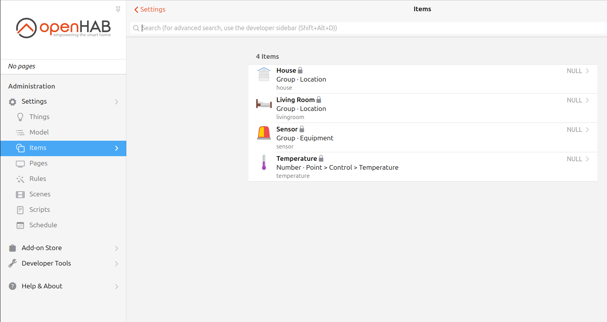

# Habdsl
Habdsl implements a mechanism to generate openHAB Items configuration DSL from:
+ Ruby internal DSL syntax.
+ Ruby internal DSL syntax and JSON data.
+ Ruby internal DSL syntax and Spreadsheet data.

It enables developers to define openHAB Items using familiar Ruby syntax, improving readability and maintainability.

For example: 
```bash
$ vim habdsl.rb
```

```ruby
require 'habdsl'

input_code = <<~RUBY
  location(name: "house", label: "House", icon: "house") do
    location(name: "livingroom", label: "Living Room", icon: "bedroom") do
      equipment(name: "sensor", label: "Sensor", icon: "siren") do
        point(name: "temperature", label: "Temperature", type: "Number",
              icon: "temperature", tags: ["Temperature"], channel: "mqtt:topic:mqttbroker:temperature")
      end
    end
  end
RUBY

output = Habdsl::DslParser.parse(input_code: input_code)
puts output.dsl
```

```bash
$ ruby habdsl.rb

Group house "House" <house> ["Location"]
Group livingroom "Living Room" <bedroom> (house) ["Location"]
Group sensor "Sensor" <siren> (livingroom) ["Equipment"]
Number temperature "Temperature" <temperature> (sensor) ["Temperature"] {channel="mqtt:topic:mqttbroker:temperature"}
```
When you have the output.dsl from habdsl, paste it into a file with the .items extension and place it in the openHAB items file storage directory.

As an example, assume that the name of the file to be pasted is `tempareture.items` and the openHAB items file storage directory is `/etc/openhab/items`.

```bash
$ ruby habdsl.rb >> /etc/openhab/items/temperature.items
```

When all is complete, the Items UI in openHAB will reflect the list of Items you have created.




## Installation

Install as a gem

```ruby
gem 'habdsl'
```

And then execute:

    $ bundle install

Or install it yourself as:

    $ gem install habdsl

## Input formats

Before using `habdsl`, make sure your **Spreadsheet** and **Ruby internal DSL code** follow the expected formats:

### Ruby internal DSL format
The Ruby DSL defines a hierarchical structure used to describe semantic models for `openHAB`.  
Each DSL element corresponds to an object (`location`, `equipment`, or `point`) and is subject to strict structural validation.

- `location` (e.g., a room or area)  
  - `equipment` (e.g., a sensor or appliance)  
    - `point` (e.g., a measurable property or control)

Each DSL block maps to a structured entity that can be validated and transformed into openHAB items.  

---

#### Hierarchy Rules

- `location` can contain:
  - other `locations` (nested)
  - `equipment`

- `equipment` can contain:
  - other `equipment'` (nested)
  - `point`
 
> - `location`**may contain nested** `location`, as well as `equipment`.
> - `point` **must be defined inside an `equipment`**
> - `point` **cannot contain any child elements**
> - `equipment` **cannot contain** `location`

❗ Violating this hierarchy will result in a validation error.

---

#### DSL Argument Validation Rules

#### `location` block

```ruby
location(name:, label:, icon:, parent: nil) do
  # ...
end
```
+ name
  + Must not start with a number.
  + Allowed characters: A-Z, a-z, 0-9, _ (underscores).
+ label
  + Any free-form string.
+ icon
  + Must be one of the icons listed in the openHAB Classic icon set: 
  https://www.openhab.org/docs/configuration/iconsets/classic/
+ parent
  + Optional.
  + Must be the name of a parent `location`.
  + If declared in a nested block, this is inferred automatically and does not need to be set explicitly.
+ type
  + Automatically set to `Group`, no need to specify.
+ tags
  + Automatically set to include `Location`, no need to specify.


#### `equipment` block
```ruby
equipment(name:, label:, icon:, parent: nil) do
  # ...
end
```
+ name
  + Must not start with a number.
  + Allowed characters: A-Z, a-z, 0-9, _ (underscores).
+ label
  + Any free-form string.
+ icon
  + Must be one of the icons listed in the openHAB Classic icon set: 
  https://www.openhab.org/docs/configuration/iconsets/classic/
+ parent
  + Optional.
  + Must be the name of a parent `location` or `equipment`.
  + If declared in a nested block, this is inferred automatically and does not need to be set explicitly.
+ type
  + Automatically set to `Group`, no need to specify.
+ tags
  + Automatically set to include `Equipment`, no need to specify.


#### `point` block
```ruby
point(name:, label:, type:, icon:, tags:, parent: nil, channel: nil)
```
+ name
  + Must not start with a number.
  + Allowed characters: A-Z, a-z, 0-9, _ (underscores).
+ label
  + Any free-form string.
+ type
  + Must be one of the valid openHAB item types listed here:
  https://www.openhab.org/docs/concepts/items.html
+ icon
  + Must be one of the icons listed in the openHAB Classic icon set: 
  https://www.openhab.org/docs/configuration/iconsets/classic/
+ tags
  + Must be one or more valid tags from the openHAB REST API endpoint: 
```sh
  $ curl -X GET "http://<openHAB_address>:<port>/rest/tags" -H "Accept: application/json"
```
+ parent
  + Optional.
  + Must be the name of a parent `Equipment`.
  + If declared in a nested block, this is inferred automatically.
+ channel
  + Optional.
  + Select the UID of the Things you want to link to this Items.


**Valid Example:**
```ruby
location(name: "house", label: "House", icon: "house") do
  table.each do |room|
    location(name: "#{room[:name]}", label: "#{room[:label]}", icon: "bedroom") do
      equipment(name: "#{room[:name]}_sensor", label: "#{room[:name]}_Sensor", icon: "siren") do
        point(name: "#{room[:name]}_temperature", label: "#{room[:name]} Temperature", type: "Number",
              icon: "temperature", tags: ["Temperature"], channel: "mqtt:topic:mqttbroker:temperature")
      end
    end
  end
end
```

---
***Explanation***
+ This DSL structure defines a root location called "house", and iterates over each room from a dataset to dynamically generate nested location, equipment, and point blocks.

+ Each location represents a room, each equipment block represents a sensor in the room, and each point block defines a specific data point (e.g., temperature).

+ The DSL will be compiled into openHAB Items configuration DSL automatically.

***About table***
+ The variable table is an array of hashes that is generated by parsing either a Spreadsheet (Excel) or JSON file.
+ It is produced by using the Habdsl::SheetParser.parse(...) or Habdsl::JsonParser.parse(...) methods.
+ Each hash in table corresponds to a row of data in the input file. For example:

```json
[
  { "name": "livingroom", "label": "Living Room" },
  { "name": "bedroom", "label": "Bed Room" },
  { "name": "kitchen", "label": "Kitchen" }
]
```
+ Using table.each, the code dynamically creates DSL definitions based on that data.

---


### Spreadsheet
The Spreadsheet serves as a data source that is combined with your Ruby internal DSL code to automatically generate openHAB Items configuration DSL.

Each row (after the header) represents a unit of configuration, such as a room, a device, or a sensor, and contains fields like name and label. These fields are injected into the DSL using iteration (typically via table.each), allowing you to dynamically define multiple items based on spreadsheet contents.

- The **first row** must contain the **headers** (column names).
- Each **subsequent row** represents one configuration entry (e.g., an openHAB item).
- The headers can be arbitrary, but must match the keys used in the Ruby DSL code (e.g., `:name`, `:label`, etc.).

**Example:**

| name  | label  |
|-------|--------|
| livingroom | Living Room  |
| bedroom | Bed Room  |
| kitchen | Kitchen  |

### JSON
The JSON file provides structured data that will be dynamically combined with your Ruby internal DSL code to generate openHAB Items configuration DSL.

Each object in the JSON array corresponds to a unit of configuration — for example, a room or device — and the data it contains (such as name and label) is injected into the DSL using iteration (typically via table.each).

+ The JSON file must represent an array of objects (dictionaries/hashes).

+ Each object represents one configuration entry (e.g., an openHAB item).

+ The keys in each object should match the ones used in the Ruby DSL code (e.g., :name, :label, etc.).

**Example:**

```json
[
  { "name": "livingroom", "label": "Living Room" },
  { "name": "bedroom",    "label": "Bed Room" },
  { "name": "kitchen",    "label": "Kitchen" }
]
```


## Usage
### Examples
The sample code is placed in example/.
Try it out by executing it.

```sh
$ bundle exec ruby example/example_dslparser.rb
$ bundle exec ruby example/example_jsonparser.rb
$ bundle exec ruby example/example_sheetparser.rb
```


### Make openHAB's Items configuration DSL from SpreadSheet
You can use the `Habdsl::SheetParser` class so habdsl automatically parses an Spreadsheet and Ruby internal DSL code, combining them to generate openHAB Items configuration DSL for item configuration.

#### Example usage
```ruby
require 'habdsl'

input_code = File.read("path/to/your_ruby_dsl_file")
excel_path = "path/to/your_excel_file"
output = Habdsl::SheetParser.parse(input_code: input_code, excel_path: excel_path)
output.table
# => Returns an array of hashes.
# Each hash maps the spreadsheet’s headers (from the first row) to the corresponding values in each data row.
# For example, if the headers are :name and :label:
# [
#   { "name": "livingroom", "label": "Living Room" },
#   { "name": "bedroom",    "label": "Bed Room" },
#   { "name": "kitchen",    "label": "Kitchen" }
# ]

output.dsl
# => Returns a string containing the generated openHAB Items configuration DSL. 
# For example, 

# Group house "House" <house> ["Location"]
# Group livingroom "Living Room" <bedroom> (house) ["Location"]
# Group livingroom_sensor "livingroom_Sensor" <siren> (livingroom) ["Equipment"]
# Number livingroom_temperature "livingroom Temperature" <temperature> (livingroom_sensor) ["Temperature"]
# Group bedroom "Bed Room" <bedroom> (house) ["Location"]
# Group bedroom_sensor "bedroom_Sensor" <siren> (bedroom) ["Equipment"]
# Number bedroom_temperature "bedroom Temperature" <temperature> (bedroom_sensor) ["Temperature"]
# Group kitchen "Kitchen" <bedroom> (house) ["Location"]
# Group kitchen_sensor "kitchen_Sensor" <siren> (kitchen) ["Equipment"]
# Number kitchen_temperature "kitchen Temperature" <temperature> (kitchen_sensor) ["Temperature"]
```

### Make openHAB's Items configuration DSL from JSON
You can use the `Habdsl::JsonParser` class so habdsl automatically parses an JSON code and Ruby internal DSL code, combining them to generate openHAB Items configuration DSL for item configuration.

#### Example usage
```ruby
require 'habdsl'

input_code = File.read("path/to/your_ruby_dsl_file")
json_code = File.read("path/to/your_json_file")
output = Habdsl::JsonParser.parse(input_code: input_code, json_code: json_code)
output.table
# => Returns an array of hashes.
# For example, 
# [
#   { "name": "livingroom", "label": "Living Room" },
#   { "name": "bedroom",    "label": "Bed Room" },
#   { "name": "kitchen",    "label": "Kitchen" }
# ]

output.dsl
# => Returns a string containing the generated openHAB Items configuration DSL 
# For example, 

# Group house "House" <house> ["Location"]
# Group livingroom "Living Room" <bedroom> (house) ["Location"]
# Group livingroom_sensor "livingroom_Sensor" <siren> (livingroom) ["Equipment"]
# Number livingroom_temperature "livingroom Temperature" <temperature> (livingroom_sensor) ["Temperature"]
# Group bedroom "Bed Room" <bedroom> (house) ["Location"]
# Group bedroom_sensor "bedroom_Sensor" <siren> (bedroom) ["Equipment"]
# Number bedroom_temperature "bedroom Temperature" <temperature> (bedroom_sensor) ["Temperature"]
# Group kitchen "Kitchen" <bedroom> (house) ["Location"]
# Group kitchen_sensor "kitchen_Sensor" <siren> (kitchen) ["Equipment"]
# Number kitchen_temperature "kitchen Temperature" <temperature> (kitchen_sensor) ["Temperature"]
```

### Make openHAB's Items configuration DSL from Only DSL
You can use the `Habdsl::DslParser` class so habdsl automatically parses an Ruby internal DSL code and generate openHAB Items configuration DSL.

#### Example usage
```ruby
require 'habdsl'

input_code = <<~RUBY
  location(name: "house", label: "House", icon: "house") do
    location(name: "livingroom", label: "Living Room", icon: "bedroom") do
      equipment(name: "sensor", label: "Sensor", icon: "siren") do
        point(name: "temperature", label: "Temperature", type: "Number",
              icon: "temperature", tags: ["Temperature"])
      end
    end
  end
RUBY

output = Habdsl::DslParser.parse(input_code: input_code)
output.table
# => Returns nil.


output.dsl
# => Returns a string containing the generated openHAB Items configuration DSL 
# For example, 

# Group house "House" <house> ["Location"]
# Group livingroom "Living Room" <bedroom> (house) ["Location"]
# Group livingroom_sensor "livingroom_Sensor" <siren> (livingroom) ["Equipment"]
# Number livingroom_temperature "livingroom Temperature" <temperature> (livingroom_sensor) ["Temperature"]
```


### Make openHAB's Items configuration DSL by using `bin/habdsl_cli.rb`

You can use the `bin/habdsl_cli.rb` script to interactively select an Spreadsheet file, input Ruby internal DSL via the terminal, and automatically generate openHAB Items configuration DSL.

This command-line tool performs the following steps:

1. Prompts you to navigate directories and select a spreadsheet file (`.xls`, `.xlsx`, or `.xlsm`).
2. Accepts Ruby internal DSL code via standard input (end with two consecutive empty lines or `Ctrl + D`).
3. Combines the spreadsheet data and DSL to generate openHAB Items configuration DSL.
4. Prompts you for an output filename and saves the generated DSL under the `output/` directory.

#### Example usage

```sh
$ bundle exec ruby bin/habdsl_cli.rb
```
You'll then be prompted to:

1. Select an Spreadsheet file
2. Enter your Ruby DSL code
3. Provide a name for the output file (e.g., my_items.items)
4. After completion, the result will be saved in:
`output/your_output_file.items`

If any syntax errors or processing issues occur, they will be printed to the console with a detailed backtrace.


## Development

TODO

## Contributing

Bug reports and pull requests are welcome on GitHub at https://github.com/[USERNAME]/habdsl. This project is intended to be a safe, welcoming space for collaboration, and contributors are expected to adhere to the [code of conduct](https://github.com/[USERNAME]/habdsl/blob/main/CODE_OF_CONDUCT.md).

## License

The gem is available as open source under the terms of the [MIT License](https://opensource.org/licenses/MIT).

## Code of Conduct

Everyone interacting in the JayFlavoredMarkdown project's codebases, issue trackers, chat rooms and mailing lists is expected to follow the [code of conduct](https://github.com/[USERNAME]/habdsl/blob/main/CODE_OF_CONDUCT.md).